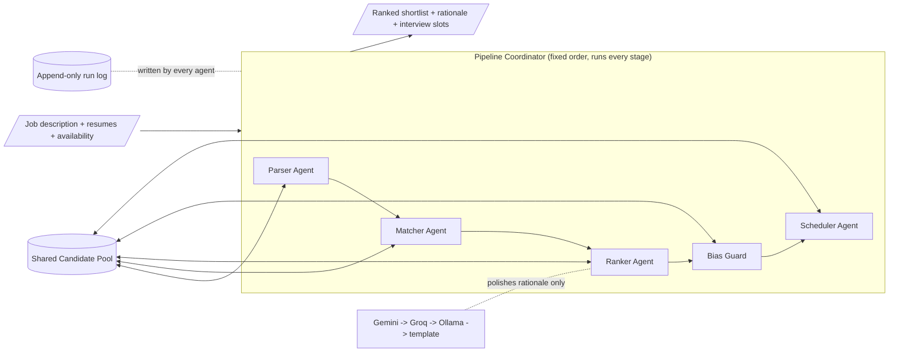

# HireFlow architecture (Mermaid source)

The picture is `architecture.png`. This is the same design as editable text; paste it into any Mermaid viewer.

```mermaid
flowchart LR
    IN[/"Job description + resumes + availability"/] --> C
    subgraph C["Pipeline Coordinator (fixed order, runs every stage)"]
        direction LR
        P["Parser Agent"] --> M["Matcher Agent"] --> R["Ranker Agent"] --> B["Bias Guard"] --> S["Scheduler Agent"]
    end
    C --> OUT[/"Ranked shortlist + rationale + interview slots"/]
    POOL[("Shared Candidate Pool")] <--> P
    POOL <--> M
    POOL <--> R
    POOL <--> B
    POOL <--> S
    LOG[("Append-only run log")] -.written by every agent.- C
    LLM["Gemini -> Groq -> Ollama -> template"] -.polishes rationale only.- R
```
